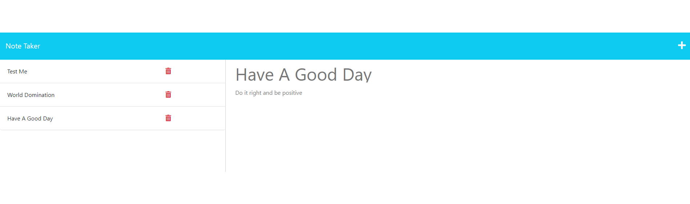

# Note Taker 

## Description
This is a note taking application that runs in the browser using an api that stores notes on the server-side. This is an express.js application.

## Table of Contents
- [Installation](#installation)
- [Usage](#usage)
- [License](#license)
- [Contributing](#contributing)
- [Tests](#tests)
- [Questions](#questions)

## Installation
To install open in your code editor and run an npm i to get the express module, then run npm start to start the server, then the application is ran at localhost:3001

## Usage
To use simply navigate to the note taking page and select already made notes to view or create a new note with the button or delete an existing note with it's corresponding delete button.

## License
[http://www.wtfpl.net/about/](http://www.wtfpl.net/about/)  
~~~
      DO WHAT THE FUCK YOU WANT TO PUBLIC LICENSE 
      Version 2, December 2004 

Copyright (C) 2004 Sam Hocevar <sam@hocevar.net> 

Everyone is permitted to copy and distribute verbatim or modified 
copies of this license document, and changing it is allowed as long 
as the name is changed. 

DO WHAT THE FUCK YOU WANT TO PUBLIC LICENSE 
TERMS AND CONDITIONS FOR COPYING, DISTRIBUTION AND MODIFICATION 

0. You just DO WHAT THE FUCK YOU WANT TO.
~~~

## Contributing
If you would like to contribute to this project feel free to reach out to me on Github or by email. One thing would be adding an edit button.

## Tests
To test simply create a note and have fun.

## Questions
For any questions contact me on:  
Github: [https://github.com/MitchH10](github.com/MitchH10) or  
Email: [mjh10@live.com](mjh10@live.com)

## Link to repo
[https://github.com/MitchH10/Note-Taker](https://github.com/MitchH10/Note-Taker)

